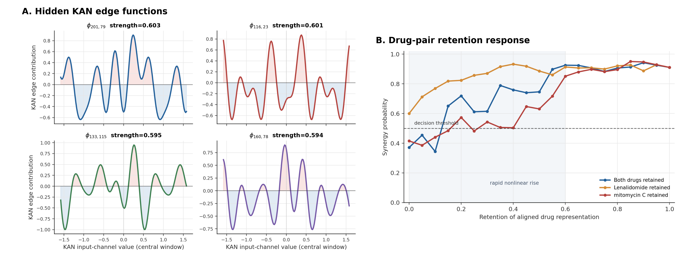

# 真实案例：Lenalidomide + mitomycin C @ IGROV1

## 案例基本信息

- 样本编号：57954
- 数据来源：ALMANAC
- 细胞系：IGROV1
- 组织来源：ovary
- 药物 A：Lenalidomide
- 药物 B：mitomycin C
- 真实标签：协同
- Loewe score：12.3335
- ZIP score：7.2351
- Bliss score：11.8549
- HSA score：15.1472
- 使用划分：cold-drug, seed 42
- 泄漏检查：Lenalidomide 和 mitomycin C 均未出现在训练集药物中

## 模型预测

解释模型为 `HgKAN-HG`，即药物编码器使用普通 GCN，drug-drug-cell 超图交互模块使用 KAN 消息函数。该模型在 cold-drug 测试集中将该样本预测为协同。选择该模型做案例解释，不是因为它在所有指标上最优，而是因为它对该样本预测正确，并且超图交互模块中的 KAN edge function 可以直接采样成曲线。

在 best epoch 49 的测试预测文件中：

- 预测非协同概率：0.0506
- 预测协同概率：0.9494
- 预测类别：协同

解释脚本在同一类 checkpoint 上得到的基准协同概率为 0.9106。由于解释脚本直接对模型前向扰动，和 best prediction CSV 的保存路径略有差异，二者数值不完全相同，但结论一致：模型高置信度预测该组合为协同。

## 药物扰动结果

| 扰动方式 | 协同概率 | 相对原始预测变化 |
|---|---:|---:|
| 原始输入 | 0.9106 | 0.0000 |
| 屏蔽 Lenalidomide | 0.5997 | -0.3110 |
| 屏蔽 mitomycin C | 0.4152 | -0.4954 |
| 同时屏蔽两种药物 | 0.3711 | -0.5395 |

这个结果说明模型的判断主要依赖药物结构和药物对交互。尤其是屏蔽 mitomycin C 或同时屏蔽两种药物后，预测概率从协同区间下降到非协同区间。论文主图因此只保留药物相关扰动，不把细胞表达屏蔽作为主论据。

## 药物对表征保留响应曲线

为了检验模型是否真的学到了药物对相关信号，这里在药物屏蔽实验之外进一步构造药物对表征保留响应曲线。做法是保持细胞系表示不变，将模型编码后的药物 A 和药物 B 表示乘以 \\(\alpha\\in[0,1]\\)，从两药被屏蔽逐步恢复到原始输入，并记录预测协同概率。论文第 6 章将这条曲线作为案例主图 B，与药物扰动柱状图一起说明模型输出确实随药物对信息恢复而变化。

这条曲线的含义是模型层面的 drug-pair/cell 交互干预响应，而不是可直接测量的生物化学剂量曲线。因此它的主要作用不是替代真实剂量-反应实验，而是把“屏蔽药物会改变预测”扩展为“药物对表示连续恢复时，模型输出也连续且非线性地恢复”。关键观察如下：

- 两药同时保留时，\\(\alpha=0\\) 的协同概率为 0.3711，对应两药屏蔽；\\(\alpha=0.15\\) 时升至 0.6506，已经跨过 0.5 判别阈值；\\(\alpha=0.60\\) 时为 0.9256，接近原始预测 0.9106。
- 单药保留曲线与扰动分析一致：mitomycin C 表示被削弱时恢复更慢，和“屏蔽 mitomycin C 的预测下降更大”相互印证。
- KAN edge function 的非线性不是直接药理公式，但它可以和这种样本级响应曲线放在一起解释：KAN 在隐藏消息函数中学习到非线性变换，而模型输出对药物对表征恢复也表现出非线性响应。

## 可视化解释

综合解释图如下：

图中四个部分分别表示：

1. 药物扰动：量化 Lenalidomide、mitomycin C 和两药组合对预测结果的贡献。
2. 药物对表征保留响应：展示两药编码表示逐步恢复时，协同概率如何从非协同区间快速上升。
3. Lenalidomide 原子 saliency：展示当前预测中贡献较大的分子区域。
4. mitomycin C 原子 saliency：展示当前预测中贡献较大的分子区域。

这个案例的解释性强点在于，它可以和已知药物作用区域做弱验证。Lenalidomide 的 saliency 主要落在含羰基和含氮环区域，和 Cereblon 结合相关的 imide/glutarimide 区域相符；按原子 saliency 排名，前 12 个原子覆盖 glutarimide 环核心 6 个原子中的 6 个。mitomycin C 的 saliency 主要落在醌样/mitosene 骨架和含氮环附近，而 mitomycin C 的抗肿瘤作用与 DNA 烷基化和交联有关；其前 10 个 saliency 原子覆盖 quinone 环核心 6 个原子中的 6 个，前 12 个 saliency 原子覆盖 mitosene 相关核心 13 个原子中的 10 个。这个结果不能证明模型发现了新机制，但可以说明模型高亮的区域不是随机的、不可读的 embedding 噪声，而是能落到真实化学结构上的候选作用区域。

## 论文中可以使用的解释性结论

该案例可以支持以下论文表述：

> 在 cold-drug 测试场景下，模型仍然能够正确识别 Lenalidomide 与 mitomycin C 在 IGROV1 细胞系上的协同作用。药物扰动显示，当同时屏蔽两种药物时，预测协同概率从 0.9106 降至 0.3711，说明模型预测依赖药物对结构信息而非仅由类别先验给出判断。药物对表征保留响应曲线进一步显示，当两药表示从屏蔽状态恢复到 15% 时，预测概率已跨过协同判别阈值，说明模型输出对药物对交互信息具有非线性敏感性。第 5 章的 KAN edge-function 可视化则提供函数级证据：模型在 drug-drug-cell 消息函数中学习到非线性变换，而不是只做线性加权。原子 saliency 把样本解释定位回真实分子结构：Lenalidomide 的高亮区域覆盖 Cereblon 结合相关的 glutarimide 环核心，mitomycin C 的高亮区域覆盖其 DNA 烷基化/交联机制相关的 quinone/mitosene 骨架。

需要谨慎的是，该案例不能被写成“证明模型发现了 Lenalidomide 与 mitomycin C 的真实药理机制”。当前解释仍然停留在模型内部层面：KAN 曲线的横轴是隐藏通道，药物对表征保留曲线的横轴是编码表示保留比例，都不是真实剂量或可测生化变量；原子 saliency 是 embedding 梯度，不等同于实验验证的药效团。更稳妥的写法是：该案例证明模型确实利用药物对结构，模型输出对药物对表征干预具有非线性响应，并且高 saliency 分子区域与已知药物作用区域有可解释的一致性。
