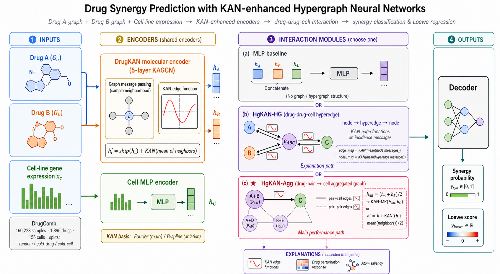
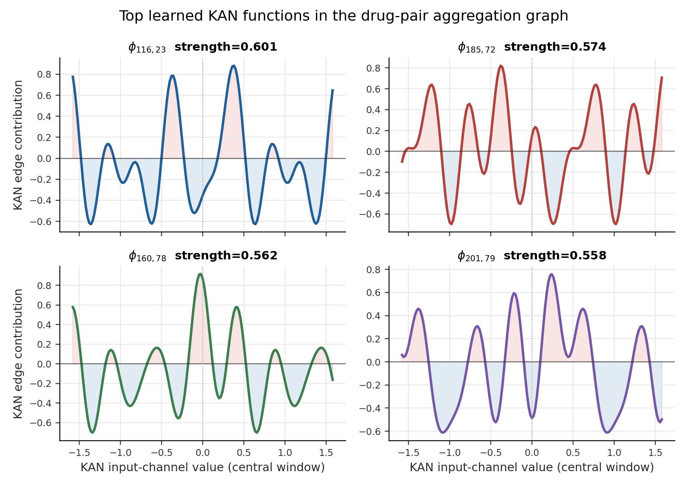
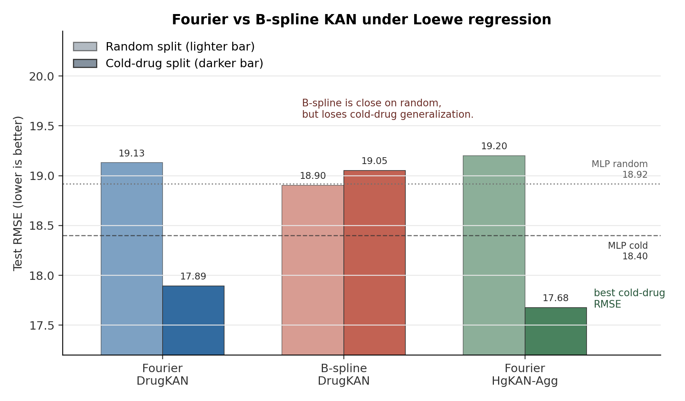
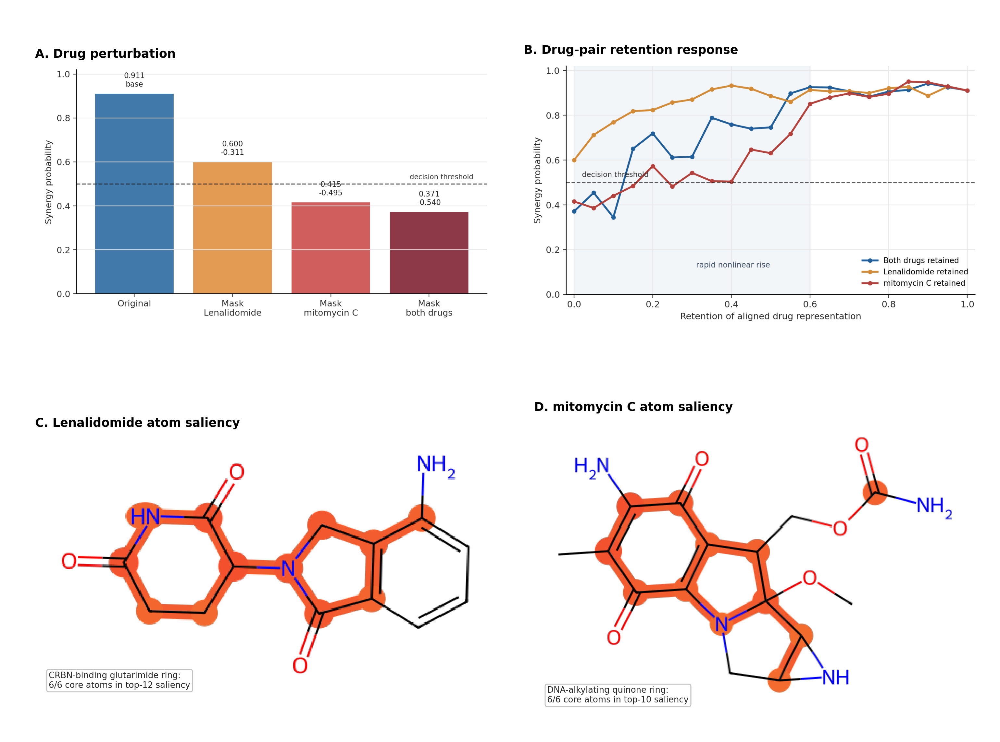

# 基于KAN超图的药物协同预测研究

## 摘要

联合用药是肿瘤治疗和复杂疾病干预中的重要策略，但候选药物组合数量随药物规模、剂量水平和细胞背景呈组合爆炸式增长，完全依赖湿实验筛选成本高、周期长。本文围绕 Kolmogorov-Arnold Network（KAN）在药物组合协同效应预测中的适用方式展开研究，基于 DrugComb 相关数据构建约 16 万条药物组合样本，整合药物分子图、细胞系表达、协同二分类标签与连续 Loewe 分数，并在 random 与 cold-drug 场景下评估模型性能。

研究发现，直接用 KAN 替换最终 MLP 预测头不能稳定提升性能，说明 KAN 不是面向高维拼接特征的通用替代模块。基于这一观察，本文进一步将 KAN 放入图神经网络和超图神经网络的结构化消息传递过程中，分别实现 DrugKAN 药物图编码器、drug-drug-cell 三元超图模块和药物对-细胞聚合图模块。实验结果显示，在 random split 下 KAN 变体未稳定超过 MLP baseline；在更接近新药筛选需求的 cold-drug split 下，HgKAN-Agg 是本文当前实验中唯一同时超过 MLP baseline 分类与回归主要指标的 KAN 主变体，分类 AUPR/AUC 分别为 0.2765/0.7452，Loewe 回归 RMSE/MAE 分别为 17.6763/12.8615。

此外，本文构建了 KAN 边函数曲线、药物扰动、药物对表征保留响应曲线和原子 saliency 等解释工具。Lenalidomide 与 mitomycin C 在 IGROV1 细胞系上的 cold-drug 案例表明，模型预测对药物对输入具有明显依赖，原子 saliency 高贡献区域与已知药理相关子结构存在可解释重合。本文结论是：KAN 在药物协同预测中更适合作为结构化消息传递中的可学习非线性函数，而不是无结构地替代最终 MLP。

关键词：药物协同预测；KAN；图神经网络；超图神经网络；可解释机器学习

## 1 绪论

### 1.1 研究背景与意义

药物研发正在经历由经验驱动、实验驱动向数据驱动和模型辅助决策转变的过程。人工智能技术已经被用于靶点发现、虚拟筛选、活性预测、药物重定位和临床试验设计等环节[1]。在肿瘤治疗中，单药方案往往受到耐药性、毒副作用和肿瘤异质性的限制，联合用药能够通过多靶点调控提高治疗效果，也可能在降低单药剂量的同时维持疗效。因此，发现具有协同作用的药物组合，是精准医学和抗癌药物研发中的重要问题。

然而，药物组合筛选面临明显的组合爆炸。若候选药物数量为 \\(n\\)，仅考虑无序二药组合就有 \\(n(n-1)/2\\) 种；进一步考虑不同剂量矩阵、不同肿瘤细胞系、不同培养条件和不同协同评分体系，实验空间会迅速扩大到难以穷尽的规模。DrugComb 等数据库整合了大量公开药物组合实验结果，为计算模型提供了训练数据[2-3]；NCI-ALMANAC 等项目也系统筛选了抗癌药物组合，为后续建模提供了真实实验基础[4]。这些资源使得基于机器学习的药物组合预筛选成为可能：模型先在历史实验中学习药物结构、细胞背景与协同效应之间的关系，再用于缩小后续湿实验验证范围。

药物协同预测与普通分子性质预测不同。普通分子性质预测通常关注单个分子在某一任务上的活性或毒性，而药物协同效应本质上是一个条件交互问题：同一药物对在不同细胞系上可能表现不同，同一药物在不同搭档存在时也可能产生不同作用。也就是说，预测对象并不是药物 A、药物 B 或细胞系的孤立属性，而是“药物 A、药物 B、细胞系背景”共同决定的三元关系。若模型只是将两种药物的向量和细胞表达向量拼接后输入 MLP，理论上具有拟合能力，但结构上并未显式表达这种三元交互。本文正是从这一点出发，研究如何把 KAN 的可学习一维函数放入更符合药物组合结构的图或超图消息传递中。

本文选择 KAN 作为研究对象，原因有两方面。第一，KAN 以边上的可学习单变量函数替代传统 MLP 中固定激活函数与线性权重组合，提供了可视化函数曲线的可能性[21]。这与药物发现中对模型可解释性的需求相契合。第二，KAN 的“边函数加节点求和”形式与图神经网络的“消息函数加邻域聚合”形式存在结构对应。因此，KAN 未必适合无结构地拟合高维拼接向量，却可能适合作为图消息传递中的非线性消息函数。本文的核心问题不是简单证明 KAN 比 MLP 更强，而是辨析 KAN 在药物协同预测中应当放在哪里、哪些放置方式有效、哪些方式无效。

从实际应用角度看，计算模型在药物组合筛选流程中通常承担“优先级排序”而不是“最终判定”的角色。湿实验仍然是确认药物协同作用的必要环节，但模型可以把候选空间从数十万甚至上百万个组合缩小到更可验证的范围。一个可用的预测模型不仅要在历史样本上拟合准确，还要能在未见药物、未见细胞背景或低频药物组合上保持合理排序。否则，模型在 random split 中取得较高指标，也可能只是利用了高频药物和高频细胞系的统计规律，难以真正帮助新组合发现。因此，本文在论文叙事上并不把 random split 的插值性能作为唯一依据，而是将 cold-drug 泛化、模型放置位置和解释性分析共同作为判断标准。

此外，药物协同预测中的“可解释”也不同于一般机器学习任务中的特征重要性展示。药物研发人员更关心模型是否关注到合理的分子子结构、药物对关系和细胞背景，而不是某个抽象隐藏维度的数值大小。若模型预测一个组合为协同，但其解释结果只显示某些不可读的 embedding 维度，实际帮助有限。本文引入 KAN 的一个动机正是希望在图消息函数层面提供可视化入口，再结合扰动实验和原子级 saliency，把解释逐步落到药物结构上。虽然这种解释仍不能替代实验机制验证，但比单纯输出协同概率更有助于判断模型是否在利用合理信号。

### 1.2 药物协同预测的主要挑战

药物协同预测首先面临标签定义复杂的问题。常见协同评分包括 Loewe additivity、Bliss independence、HSA 和 ZIP 等，不同评分体系对“无相互作用”的零假设并不相同[5-6]。同一药物对在某一评分下可能被判定为协同，在另一评分下可能只是加和或近似无交互。因此，模型性能不仅取决于输入表示和网络结构，也取决于训练目标是否与应用场景一致。本文选择 Loewe score 作为连续回归目标，并根据预处理阈值构造协同二分类标签，同时保留 ZIP 分数用于案例分析，以便避免把某一种评分体系误读为唯一真实标准。

第二个挑战是类别不平衡。药物组合数据中真正表现出明显协同作用的样本通常远少于非协同或弱协同样本。本文数据集中正例比例约为 14.8%，这意味着模型即使简单偏向负类也能获得较高准确率，但对药物筛选最重要的是能否从大量候选组合中排出少量高价值正例。因此，本文分类任务主要使用 AUPR 和 AUC，而不是只看 accuracy；其中 AUPR 对正例比例变化更敏感，更适合不平衡筛选任务。

第三个挑战是数据划分带来的泛化差异。random split 中，同一药物和细胞系可能同时出现在训练集和测试集中，只是具体组合样本不同。这种划分可以评估模型对已知药物空间的插值能力，却不能充分反映新药候选筛选中的外推难度。相反，cold-drug split 要求测试集药物不出现在训练集中，更接近“用已有药物组合实验训练模型，再预测未见药物组合”的真实场景。本文在实现中对 cold-drug 划分进行了泄漏检查，严格要求训练药物集合与测试药物集合没有交集，避免由于同一药物同时出现而高估泛化能力。

第四个挑战是可解释性。药物发现是高风险应用，模型给出的预测分数通常只能作为实验优先级线索，不能直接作为药理结论。若模型无法解释其依赖的药物结构区域、细胞背景或组合交互，后续实验人员很难判断预测是否具有生物化学合理性。机器学习和深度学习可解释性研究已经提出了特征重要性、梯度分析、局部替代模型和可视化等多类方法[23-24]，但药物组合任务还需要把解释从抽象向量维度进一步连接到药物对扰动、分子子结构和细胞背景上。本文在案例分析中将 KAN 函数曲线、药物屏蔽、药物对表征保留响应和原子 saliency 组合使用，目的是形成从函数级到样本级再到分子结构级的解释链条。

第五个挑战是实验结论容易受到评价协议影响。药物组合数据往往包含同一药物在多个细胞系、多个搭档和多个实验来源中的重复出现。如果训练集与测试集只在样本行上随机拆分，而不在药物或细胞实体上做约束，模型可能通过识别已见药物的平均协同倾向获得较高分数。这种分数在工程上并非完全没有意义，因为实际部署中也可能预测已知药物的新组合；但它不能证明模型具备新药泛化能力。本文因此把 random split 和 cold-drug split 明确区分：前者用于检查基本拟合能力，后者用于考察更接近真实候选药物筛选的外推能力。对于本文的 KAN 变体，二者结论并不完全一致，这也说明选择评价协议本身就是药物协同预测研究中的关键环节。

### 1.3 本文研究问题与技术路线

本文的研究问题可以概括为三个层次。第一，直接用 KAN 替换 MLP 预测头是否有效。这个问题对应最朴素的模型替换思路：将药物 A、药物 B 和细胞系嵌入拼接后，不再用 MLP 输出协同概率或 Loewe 分数，而是用 KAN head 进行预测。实验结果显示，这种方式在 random 和 cold-drug 场景下均没有稳定收益，尤其在 cold-drug 分类中明显退化。因此，本文没有把“直接替换 MLP”作为最终路线，而是把它作为负结果证据。

第二，KAN 是否应当放入单药分子图编码器。药物分子天然可以表示为图结构，节点表示原子，边表示化学键。图神经网络能够通过局部消息传递学习分子结构表征[14-18]。本文实现 KAN 增强的药物图编码器 DrugKAN，在邻居聚合后使用 KANLinear 更新节点表示，检验 KAN 是否能够在局部分子结构层面捕捉对药物协同有用的非线性模式。实验表明，DrugKAN 在 cold-drug 回归中有一定收益，但在分类任务中不稳定，说明单药侧 KAN 能提供部分结构信号，却不足以单独解决组合交互判别。

第三，KAN 是否更适合作为 drug-drug-cell 交互模块中的消息函数。由于一个药物协同样本同时包含两个药物和一个细胞系，本文构建了两类结构化交互模块：一类是将药物 A、药物 B 和细胞系组成三元超边的超图模块；另一类是先把两种药物聚合为 drug-pair 节点，再与 cell 节点构成药物对-细胞聚合图。前者更直接表达三元关系，后者更强调药物对作为组合实体。实验结果显示，HgKAN-Agg 在 cold-drug 分类和回归中表现最好，支持“先用结构完成分组，再让 KAN 学习局部非线性函数”的技术路线。

### 1.4 本文主要贡献

本文的主要贡献不是提出全新的药理学公式，也不是声称在所有指标上达到最先进性能，而是在一个真实药物组合预测任务中系统分析 KAN 的有效放置方式。具体包括以下四点。

第一，本文构建了基于 DrugComb 的药物协同预测实验数据，包含药物分子图、细胞系表达、二分类协同标签和连续 Loewe 分数，并实现 random 与 cold-drug 划分。对于 cold-drug 场景，本文进行药物集合重叠检查，确保测试药物不在训练集中出现，从而减少数据泄漏导致的虚高结果。

第二，本文实现并比较了多类 KAN 变体，包括直接 KAN head、DrugKAN 药物图编码器、KAN 超图交互模块、KAN 药物对-细胞聚合图模块以及 DrugKAN 与 HgKAN 的叠加模型。通过这些消融，本文能够区分“增加 KAN 参数”与“把 KAN 放在合适结构中”之间的差异。

第三，本文报告了正结果和负结果。结果表明，KAN head 直接替换 MLP 明显退化，DrugKAN 的收益具有任务依赖性，HgKAN-HG 更适合作为解释性模块，而 HgKAN-Agg 是当前实验中最稳定的 cold-drug 正结果。这样的叙事比单纯报告最优模型更符合真实研究过程，也有助于后续工作避免无结构堆叠 KAN。

第四，本文构建了可解释性分析流程。通过 KAN 边函数曲线观察模型内部非线性消息函数，通过药物扰动和药物对表征保留响应检验输出是否依赖药物对信息，通过原子 saliency 将预测贡献定位回真实分子结构。该流程不能直接证明模型发现了新的生化定律，但能够为模型预测是否具有合理结构依据提供证据。

## 2 相关工作

### 2.1 药物协同评价体系与数据资源

药物协同效应的定义依赖参考模型。Loewe additivity 基于两种药物具有相似作用机制时的剂量等效思想，关注组合剂量是否低于单药等效剂量；Bliss independence 假设两药作用相互独立，组合效应可由单药效应概率组合得到；HSA 关注组合效应是否超过最强单药；ZIP 则试图综合剂量反应曲面中的零交互假设[5-6]。这些指标并不是彼此等价的数学变换，而是反映了不同药理假设。因此，药物协同预测研究需要明确使用的标签来源和阈值规则。本文使用 Loewe score 作为主要连续目标，是因为 Loewe 在 DrugComb 相关处理中较常用，也便于与已有组合筛选研究比较。

数据资源方面，DrugComb 提供了整合式药物组合数据入口，覆盖多来源药物组合实验、不同协同评分和细胞系信息[2-3]。NCI-ALMANAC 则系统筛选了抗癌药物组合，是药物组合建模中常用的真实数据来源之一[4]。这些数据集一方面为深度学习模型提供了规模基础，另一方面也带来了批次差异、评分体系差异、药物名称映射、SMILES 解析失败和细胞系特征缺失等工程问题。本文的预处理过程并非只读取单一表格，而是需要将药物结构、细胞表达、组合评分和样本标签统一到一致的样本索引中。

药物组合数据还存在分布偏移。公开数据库中的药物并不是随机抽样产生的，而是受到实验设计、药物可获得性和研究热点影响。某些经典化疗药物、靶向药物和常用细胞系在数据中出现频次远高于其他实体。如果 random split 未控制实体泄漏，模型可能学习到高频药物或高频细胞系的统计先验，而不是学习真正可泛化的组合规律。因此，本文把 cold-drug split 作为最重要的泛化检验，并在结果讨论中明确区分 random 插值性能与 cold-drug 新药泛化性能。

### 2.2 基于机器学习的药物协同预测

早期机器学习方法通常基于药物化学指纹、理化描述符、靶点信息、通路信息和细胞系组学特征构建固定长度向量，再使用随机森林、支持向量机或浅层神经网络进行预测。随着深度学习在药物反应预测中的应用增加，研究者开始使用多层神经网络直接从药物特征和细胞系特征中学习非线性关系。DeepSynergy 是其中具有代表性的工作，它将药物化学描述符与细胞系基因表达输入深度神经网络，用于预测抗癌药物协同作用[7]。国内也有研究使用多输入神经网络进行药物组合协同作用预测[8]，说明将药物与细胞特征分支编码再融合，是该领域较自然的技术路线。

机器学习方法的优势在于实现简单、训练稳定、可以利用较多人工构造特征；不足在于对药物结构的利用依赖预计算描述符，且对 drug-drug-cell 三元关系的结构表达不够明确。许多方法将两个药物向量和细胞向量拼接后输入 MLP，这种方式将组合关系交给后续全连接层自行拟合。理论上，足够大的 MLP 可以逼近复杂函数，但它没有内置“两个药物先形成组合实体，再与细胞背景发生条件交互”的归纳偏置。对于训练样本相对充足的 random split，这种方法可能已经足够；但在 cold-drug 场景中，模型需要对未见药物进行泛化，结构归纳偏置可能更加重要。

近年来也有研究引入 SMILES 序列、Transformer 预训练模型和注意力机制进行药物协同预测。例如 SMILESynergy 使用 Transformer 预训练表示增强抗癌药物协同预测[9]。这类方法强调从药物字符串或分子序列中学习更丰富的单药表示，但组合交互层仍然是关键问题。若模型主要提升单药表示，却没有显式处理两个药物在具体细胞背景下的相互作用，则在新药组合筛选场景中仍可能遇到泛化限制。本文的 DrugKAN 实验也体现了类似结论：单药图编码器改进可以改善部分回归指标，但分类协同判别更依赖组合交互模块。

药物反应预测和药物协同预测之间存在联系。GDSC 等药物敏感性资源推动了癌症细胞系药物反应建模[10-12]，这些工作证明基因组和化学性质可以用于预测细胞对药物的敏感性。但药物协同预测比单药敏感性多了一层组合关系，模型不仅要知道每个药物是否有效，还要判断两药同时作用时是否超过参考模型给出的期望效应。因此，本文在模型设计中没有把协同预测简化为两个单药响应的相加，而是将 drug-drug-cell triplet 作为基本样本单元。

从特征工程角度看，传统方法往往依赖药物相似性、靶点相似性、通路相似性或已知药物相互作用网络。这些信息对于药物组合预测很有价值，但也存在覆盖不足的问题。许多候选药物缺少完整靶点注释，部分新化合物只有分子结构而没有系统药理信息；不同数据库中的靶点名称、通路编号和细胞系注释也需要复杂映射。相比之下，分子图和基因表达是相对更容易统一的输入形式。本文选择以分子图和表达向量为主，并不否认靶点和通路信息的重要性，而是希望在较通用的输入条件下先研究 KAN 与结构化交互模块的作用。未来若加入靶点网络或通路图，超图结构还可以自然扩展为药物、靶点、通路和细胞系之间的多实体关系。

### 2.3 图神经网络与分子表示学习

分子天然适合表示为图：节点对应原子，边对应化学键，节点特征包括原子类型、形式电荷、芳香性、杂化方式等，边特征包括键类型、是否共轭、是否在环中等。图神经网络通过消息传递学习节点和图级表示，已经成为分子性质预测中的重要方法。GCN、MPNN、GAT 和 GIN 等模型分别从谱域卷积、消息传递、注意力聚合和表达能力等角度推动了图表示学习的发展[14-18]。国内对图神经网络和图卷积神经网络的综述也系统总结了其理论基础和应用场景[14-15]。

在药物协同预测中，图神经网络的价值主要体现在两个方面。第一，它避免完全依赖人工分子指纹，可以从分子拓扑中学习任务相关表示。第二，图消息传递提供了局部结构归纳偏置，有助于模型在未见药物上利用相似子结构进行泛化。DDoS 等方法将图神经网络用于药物协同预测，说明分子结构编码对该任务具有实际价值[13]。不过，单独的分子图编码器仍然只解决“如何表示单个药物”的问题；真正的协同预测还需要决定两个药物表示如何与细胞系背景交互。

本文中的 DrugKAN 继承了 GNN 的局部消息传递思想，但把节点更新中的线性变换和固定激活替换为 KAN 函数层。这样做的动机不是认为 KAN 必然比 GCN 更强，而是希望检验 KAN 的可学习边函数能否在原子邻域层面捕捉更适合药物组合任务的非线性结构。实验结果显示，DrugKAN 在 cold-drug 回归中确实改善 RMSE，但分类任务下降，说明单药结构编码与组合协同判别之间并不是简单单调关系。

### 2.4 超图神经网络与高阶关系建模

普通图的一条边只能连接两个节点，而许多真实关系并非成对关系。超图允许一条超边连接多个节点，因此适合表示高阶交互。超图神经网络综述指出，超图能够避免将复杂高阶关系强行分解成成对边时的信息损失[19]。药物协同样本天然包含药物 A、药物 B 和细胞系三个实体，将其建模为三元超边比简单拼接更符合任务结构。

HypergraphSynergy 将 drug-drug-cell triplet 建模为超图关系，并证明高阶关系学习有助于抗癌药物协同预测[20]。这说明超图结构本身已经是该领域有价值的方向。本文采用超图并不是为了声称超图结构的原创性，而是将其作为 KAN 的结构化载体：超图消息传递提供三元局部计算单元，使 KAN 不再直接面对无结构高维拼接输入。

不过，超图设计也有风险。若 batch 内动态构建超图，节点和超边的共享模式会受到 mini-batch 组成影响；药物节点和细胞节点类型差异较大，若使用同一组 KAN 函数处理异质实体，优化可能更困难。本文结果显示，HgKAN-HG 在解释性案例中有价值，但在整体 cold-drug 指标上不如 HgKAN-Agg。该现象提示，高阶结构并不自动带来性能提升，关键是结构设计是否符合数据规模、实体类型和优化稳定性。

### 2.5 KAN 及其与图学习的结合

KAN 受 Kolmogorov-Arnold 表示定理启发，其核心思想是在网络边上学习一维函数，而节点主要执行求和聚合[21]。与传统 MLP 中“线性权重加固定激活函数”的形式不同，KAN 为每个输入通道到输出通道之间的关系学习可参数化函数。该设计使得部分函数可以被采样和可视化，因此常被讨论为更具解释潜力的神经网络结构。

KAN 的解释潜力并不意味着它在所有任务中都优于 MLP。实际使用中，KAN 的训练稳定性、参数规模、基函数选择和输入归一化都会影响表现。对于高维拼接表示，KAN 需要为大量输入-输出通道学习边函数，参数量和优化难度可能明显增加。如果输入维度没有明确物理含义或局部结构，单变量边函数也未必能形成可解释规律。因此，本文首先检验直接 KAN head，并将其负结果作为重要观察。

近期已有工作将 Kolmogorov-Arnold 结构与图神经网络结合，用于分子性质预测[22]。这与本文假设一致：KAN 更适合放在图结构消息传递中，而不是孤立地替代最终预测头。图结构提供邻域、边和节点类型等分组信息，KAN 负责在这些局部关系中学习非线性函数。本文把这一思想进一步应用到药物组合协同预测中，特别关注 drug-drug-cell 交互层的 KAN 放置方式。

### 2.6 可解释药物预测模型

可解释性是药物预测模型能否用于实际候选筛选的重要条件。机器学习模型可解释性研究通常区分模型内在解释、事后解释、全局解释和局部解释等不同类型[23]。深度学习可解释性研究则常使用梯度、类激活映射、敏感性分析、信息论和可解释模块等方法[24]。在药物发现中，可解释性还需要满足领域约束：解释最好能够落到药物子结构、靶点通路、表达基因或剂量反应模式上，而不是停留在不可读的隐藏维度。

本文可解释性分析采取弱声明原则。KAN 边函数曲线可以说明模型内部某些隐藏通道之间学习了非线性函数，但这些曲线不是直接的药物剂量-反应曲线，也不能被解释为真实生化方程。药物扰动和药物对表征保留响应可以说明模型输出是否依赖两药信息，但仍属于模型内部干预。原子 saliency 可以把预测贡献映射回分子结构，但 saliency 与真实机制之间还需要更多样本和实验文献验证。因此，本文只将解释结果作为模型合理性证据，而不把它夸大为新的药理机制发现。

## 3 方法

### 3.1 数据来源与预处理

本文使用 DrugComb 相关数据构建药物协同预测样本。每个样本表示为：

\\[
\\left(G_a, G_b, x_c, y, s_{Loewe}\\right),
\\]

其中 \\(G_a\\) 和 \\(G_b\\) 分别表示两种药物的分子图，\\(x_c\\) 表示细胞系基因表达向量，\\(y\\in\\{0,1\\}\\) 为协同二分类标签，\\(s_{Loewe}\\) 为连续 Loewe 协同分数。分子结构由 SMILES 解析得到，节点特征和边特征采用 OGB 风格的离散化原子与化学键属性。细胞系输入为基因表达特征，并通过全连接编码器映射到与药物嵌入相同的隐空间。

预处理的关键步骤包括药物名称标准化、SMILES 去重、无效结构过滤、细胞系名称对齐、协同分数缺失处理和标签构造。由于不同来源数据对药物名称、细胞系名称和评分字段的记录方式不同，若不进行统一映射，同一药物可能被拆分成多个实体，或者不同细胞系被错误合并。本文在构建样本时保留能够成功解析分子图且具有有效细胞表达的记录，最终得到 160,228 个样本，涉及约 1,896 个唯一药物和 156 个细胞系，正例比例约为 14.8%。

对药物顺序的处理也需要注意。二药组合在药理上通常可视为无序组合，但原始数据表中可能存在 drug A 与 drug B 的字段顺序。本文在模型输入中使用对称或近似对称的药物聚合方式，例如对两种药物嵌入取平均、拼接时保持一致排序规则，避免模型把字段顺序误认为药理差异。对于超图和聚合图模块，药物 A 与药物 B 作为两个药物节点参与同一超边或被合并为 drug-pair 节点，使模型关注组合而非表格顺序。

数据预处理还需要处理样本重复和极端分数。药物组合实验可能在不同剂量矩阵、不同批次或不同数据来源中重复出现，若简单合并可能导致同一药物对在同一细胞系上出现多个不完全一致的协同分数。本文在整理数据时优先保留具有完整结构和表达信息的记录，并在模型训练中使用统一的标签构造方式。对于连续 Loewe 分数，极端值会对 RMSE 产生较大影响，因此训练时采用目标标准化，并在评价阶段还原到原始尺度。这样可以改善优化稳定性，但不会改变最终指标的物理解释。

在 cold-drug 划分中，最容易被忽视的问题是跨集合组合。若药物 A 属于训练药物集合而药物 B 属于测试药物集合，这类样本既不能简单放入训练集，也不能作为严格测试样本，因为它会使测试组合包含训练中已见药物。本文采用更严格的处理方式：只保留两个药物均属于同一集合的样本，丢弃跨集合混合药物对。这样会减少可用样本数量，尤其会使验证集和测试集变小，但可以保证 train-test 药物集合没有交集。对于新药泛化研究，这种牺牲是必要的，因为数据泄漏带来的虚高结果比样本减少更危险。

### 3.2 问题定义与总体框架

本文同时研究协同二分类和 Loewe 分数回归。分类任务输出 \\(\\hat{p}\\in[0,1]\\)，表示药物组合在给定细胞系上被预测为协同的概率；回归任务输出 \\(\\hat{s}_{Loewe}\\)，表示连续协同分数。模型总体由三部分组成：药物图编码器、细胞表达编码器和 drug-drug-cell 交互模块。

药物图编码器将 \\(G_a\\) 和 \\(G_b\\) 分别映射为药物嵌入 \\(h_a\\) 与 \\(h_b\\)。细胞表达编码器将 \\(x_c\\) 映射为细胞嵌入 \\(h_c\\)。交互模块接收 \\((h_a,h_b,h_c)\\)，输出组合表示 \\(z\\)。最后，预测头根据 \\(z\\) 输出分类概率或回归分数。不同模型变体的主要差异在于药物图编码器是否使用 KAN，以及交互模块是 MLP 拼接、KAN head、三元超图还是药物对-细胞聚合图。

本文保留 MLP baseline 作为核心对照。该 baseline 并非简单弱模型，而是一个合理的深度学习基线：它使用同样的药物图编码器和细胞编码器，只是在交互阶段将 \\(h_a\\)、\\(h_b\\) 和 \\(h_c\\) 拼接后输入 MLP。只有在与该 baseline 公平比较的基础上，才能判断 KAN 模块是否真正带来收益。

### 3.3 药物分子图与细胞系编码器

药物分子图编码器采用多层 GCN/KAGCN 结构。普通 GCN 层对节点邻居表示进行聚合，再通过线性变换和非线性激活更新节点表示。经过若干层消息传递后，使用图级 readout 得到药物嵌入。本文设置药物图编码器层数为 5，隐藏维度为 128，在不同变体中保持主要维度一致，以减少模型容量差异对实验结论的干扰。

细胞系表达向量维度通常远高于药物嵌入维度，且基因表达存在不同尺度。本文使用两层全连接网络编码细胞表达，将其压缩到与药物嵌入相同或相近的隐空间。由于细胞编码器参数量较大，模型总参数量主要由细胞表达侧和预测头决定，这也是本文后续参数量分析中 KAN 未能减少总参数数量的原因之一。

药物和细胞编码器输出后需要对齐到统一维度。对于 MLP baseline，本文直接拼接两个药物嵌入和细胞嵌入；对于超图模块，药物节点和细胞节点需要位于同一隐藏空间，才能进行 node-to-hyperedge-to-node 消息传递；对于药物对-细胞聚合图，两个药物嵌入先聚合为 drug-pair 节点，再与 cell 节点进行消息传播。

细胞系编码器在本文模型中占据较大参数比例，这一点对结果解释很重要。基因表达向量包含大量基因维度，其中既有与药物反应相关的信号，也包含实验噪声、组织来源差异和细胞系特异偏置。若细胞编码器过强，模型可能主要依赖某些细胞系的平均协同倾向；若细胞编码器过弱，则无法表达不同细胞背景下同一药物对反应的差异。本文采用较常规的全连接编码器，并通过 cold-drug 划分和药物扰动分析检查模型是否过度依赖细胞背景。案例结果显示，在屏蔽药物后预测概率明显变化，说明模型至少在该样本上没有完全退化为细胞系先验。

药物图编码器的层数也需要权衡。层数过浅时，模型只能看到非常局部的原子邻域，可能不足以表达药效团和环系结构；层数过深时，分子图上容易出现过平滑，节点表示差异被削弱。本文选择 5 层作为折中，使节点表示能够覆盖一定范围的局部化学环境，同时避免过深 GNN 带来的训练不稳定。KAN 放入节点更新后会进一步改变非线性变换形式，因此本文没有盲目增加层数，而是在保持主干结构一致的基础上比较 KAN 放置位置。

### 3.4 KAN 函数层

本文实现了 Fourier KAN 和 B-spline KAN 两类函数层。主实验采用 Fourier KAN，原因是当前任务中的 KAN 主要作用于隐藏消息函数，而不是显式剂量变量；探索实验显示 Fourier KAN 在训练速度和 cold-drug 泛化上更稳定。给定输入 \\(x\\in\\mathbb{R}^{d_{in}}\\)，KANLinear 为每个输入通道到输出通道的连接学习一组一维函数。Fourier KAN 可写为：

\\[
\\phi_{o,i}(x_i)=a_{o,i,0}+\\sum_{k=1}^{K}\\left(a_{o,i,k}\\cos(k\\pi x_i)+b_{o,i,k}\\sin(k\\pi x_i)\\right),
\\]

\\[
h_o=\\sum_i \\phi_{o,i}(x_i).
\\]

其中 \\(o\\) 表示输出通道，\\(i\\) 表示输入通道，\\(K\\) 为 Fourier 阶数。该形式的优点是实现相对简单，能够通过采样 \\(x_i\\) 观察单个输入-输出通道之间的函数曲线。本文在解释时只展示隐藏激活常见区间内的函数曲线，避免把远离训练分布的周期振荡误读为真实药理规律。

B-spline KAN 使用局部支撑基函数，理论上更适合平滑的一维函数近似。如果任务输入包含显式剂量变量，B-spline 可能更符合剂量-反应曲线的直观假设。但本文当前模型中的 KAN 输入主要是隐藏表示通道，不是药物浓度或暴露时间，因此 B-spline 的局部平滑优势没有充分发挥。本文仍保留 B-spline 探索结果，作为基函数选择的补充分析。

### 3.5 KAN 增强药物图编码器

DrugKAN 的目标是检验 KAN 是否能改善单药分子图表示。普通 GCN 层通常将邻居聚合结果输入线性层和激活函数。本文实现的 KAGCNConv 先对节点自身和邻居节点表示做平均聚合：

\\[
\\bar{h}_i = \\frac{1}{2}\\left(h_i + \\operatorname{mean}_{j\\in\\mathcal{N}(i)}h_j\\right),
\\]

再使用 KAN 更新节点：

\\[
h_i' = \\operatorname{skip}(h_i) + \\operatorname{KAN}(\\bar{h}_i).
\\]

这个设计保留了 GNN 的局部邻域归纳偏置，同时让 KAN 作用在聚合后的节点表示上。与直接对全局拼接向量使用 KAN 不同，KAGCN 的输入分布受到分子拓扑约束，每一层只处理局部原子环境。若 KAN 的优势来自可学习非线性局部函数，那么它应当更容易在该位置发挥作用。实验结果显示，DrugKAN 的确在 cold-drug 回归中有所改善，但分类性能不稳定，说明单药结构表示只能解决部分问题。

### 3.6 Drug-drug-cell 结构化交互模块

本文实现两类 drug-drug-cell 结构化交互模块。第一类是三元超图模块。在每个 batch 中，将药物节点和细胞系节点作为超图节点，每个样本对应一条包含药物 A、药物 B 和细胞系三个节点的超边。普通版本使用标准 HypergraphConv；KAN 版本使用 node-to-hyperedge-to-node 两阶段消息传递，并将部分 edge function 和 node function 替换为 KANLinear。

三元超图的优点是概念直接：药物协同样本天然就是一个三元关系，超边可以避免将其拆成药物 A-药物 B、药物 A-细胞、药物 B-细胞三条普通边时的信息损失。缺点是 batch 内动态超图的结构依赖样本组成，且药物节点和细胞节点的类型差异较大。若 KAN 函数在同一空间中处理异质节点表示，可能增加优化难度。

第二类是药物对-细胞聚合图模块。该模块先将两个药物嵌入平均或融合为 drug-pair 节点，再将 drug-pair 节点与 cell 节点连接。若 batch 内两个 drug-pair 共享某个药物，则在 drug-pair 节点之间建立边，用于传播共享药物相关信息。该设计将“药物组合”显式作为交互实体，降低三元超边中异质节点混合带来的复杂度。

从建模假设看，HgKAN-Agg 更符合本文最终观察：KAN 不擅长自动从无结构高维拼接向量中发现分组，但适合在结构已经给出的局部消息传递中学习非线性函数。drug-pair 节点相当于先把两种药物合并为组合单位，再让 KAN 学习组合单位与细胞背景之间的关系。实验结果显示，HgKAN-Agg 在 cold-drug 场景下同时改善分类和回归主要指标，是本文最重要的正结果。

图 1 展示本文整体模型框架。左侧为药物分子图和细胞表达输入，中间为普通 GCN 或 DrugKAN 分子图编码器，右侧为 MLP、超图和药物对-细胞聚合图三类交互模块。图中强调的不是单个网络层的复杂性，而是 KAN 放置位置的差异：直接预测头、单药局部图编码、三元超图交互和 drug-pair 聚合图交互分别对应不同归纳偏置。

### 3.7 训练目标与模型变体

分类任务使用二元交叉熵损失，回归任务使用均方误差损失。由于 Loewe 分数尺度较大，回归训练中对训练集目标进行标准化，并在评估时还原到原始尺度。分类任务中，由于正例比例较低，验证和测试阶段重点报告 AUPR 与 AUC；回归任务报告 RMSE、MAE 和 \\(R^2\\)。

本文比较以下主要变体：

- MLP baseline：药物 A、药物 B 和细胞系嵌入拼接后输入 MLP；
- KAN head：直接用 KAN 替换最终 MLP 预测头；
- DrugKAN：仅在药物图编码器中使用 KAN，交互模块仍为 MLP；
- HgKAN-HG：药物编码器保持普通 GCN，在三元超图交互中使用 KAN；
- HgKAN-Agg：药物编码器保持普通 GCN，在药物对-细胞聚合图中使用 KAN；
- DrugKAN+HgKAN：药物编码器和交互模块同时使用 KAN。

这种设置可以回答三个问题：KAN 是否可以直接替代 MLP；KAN 放在单药图编码器中是否有效；KAN 放在 drug-drug-cell 交互结构中是否更合适。若只报告单个模型，无法区分这些因素；通过消融比较，本文能够更明确地定位 KAN 的作用边界。

### 3.8 可解释性方法

本文解释性分析由四部分组成。第一，采样 KAN 边函数曲线。对于训练好的 KAN 模块，选择函数强度较高的输入-输出通道，在隐藏激活常见范围内采样曲线，观察其非线性形态。该方法提供函数级观察窗口，但只能说明模型内部消息函数形态，不能直接解释为真实药效曲线。

第二，进行药物扰动实验。对于给定测试样本，分别屏蔽药物 A、药物 B 和两种药物，记录协同概率变化。如果屏蔽药物后预测明显下降，说明模型确实依赖药物结构输入；如果输出几乎不变，则可能说明模型主要依赖细胞系先验或数据偏置。

第三，构造药物对表征保留响应曲线。保持细胞表示不变，将两种药物的对齐表示从零向原始表示按系数 \\(\\alpha\\in[0,1]\\) 恢复，观察输出概率随 \\(\\alpha\\) 的变化。这比离散屏蔽实验更细，可以显示模型输出是否随药物对信息恢复而呈连续或非线性响应。

第四，计算原子 embedding saliency。通过输出对原子嵌入的梯度或敏感性估计每个原子的贡献，并将高贡献原子映射回分子结构。本文在案例中检查 saliency 高亮区域是否与已知药理相关子结构重合，例如 Lenalidomide 的 glutarimide 区域和 mitomycin C 的 quinone/mitosene 骨架[25-26]。

## 4 实验设置

### 4.1 数据划分与泄漏检查

本文使用 random split 和 cold-drug split 作为主要实验场景。random split 对样本进行随机分层划分，使训练集、验证集和测试集的标签比例大致一致。该划分可以检验模型在已有药物和细胞空间中的插值能力，是许多机器学习实验的常规设置。但由于同一药物可能同时出现在训练集和测试集中，random split 不能被解释为新药泛化能力。

cold-drug split 的目标是检验模型对未见药物的泛化能力。严格的 cold-drug 划分要求测试集中的药物不出现在训练集中。本文在划分时将药物集合拆分为训练药物集合、验证药物集合和测试药物集合，只保留两个药物均属于同一集合的组合样本，并丢弃跨集合混合药物对。泄漏检查结果显示，严格生成的 cold-drug 划分中 train-test 药物重叠数为 0，样本数量为训练集 69,674、验证集 2,101、测试集 7,697。本文后续 cold-drug 结果均按照该严格划分解释。

本文也实现了 cold-cell 划分探索，但主结果集中报告 random 与 cold-drug。原因是当前实验最关注新药组合筛选，而 cold-drug 更直接对应未见药物泛化。cold-cell 更适合评估新细胞系或新患者背景的泛化能力，后续若加入更多细胞系特异性组学特征和通路信息，可以将其作为更完整的部署场景继续展开。

### 4.2 评价指标

分类任务报告 AUPR 和 AUC。AUC 衡量模型对正负样本排序的整体能力，但在正例比例较低时，AUC 可能对实际筛选性能不够敏感。AUPR 更关注正例召回与精确率之间的关系，适合药物组合预筛选场景。因此，本文在解释分类结果时优先关注 AUPR，同时结合 AUC 判断整体排序质量。

回归任务报告 RMSE、MAE 和 \\(R^2\\)。RMSE 对大误差更敏感，能够反映模型是否在高协同或强拮抗样本上出现严重偏差；MAE 更稳定，反映平均绝对误差；\\(R^2\\) 用于补充说明模型对连续 Loewe 分数方差的解释能力。由于论文主表需要简洁，正文主要展示 RMSE 与 MAE，完整实验记录中保留 \\(R^2\\)。

### 4.3 实现细节

所有模型基于 PyTorch 和 PyTorch Geometric 实现。药物图编码器使用 5 层 GCN 或 KAGCN，图嵌入维度为 128。细胞表达编码器包含两层全连接网络，输出维度与药物嵌入对齐。交互模块隐藏维度为 256。训练使用 Adam 优化器，基础学习率为 \\(10^{-4}\\)，weight decay 为 \\(10^{-4}\\)，batch size 为 128，最多训练 80 个 epoch，并根据验证集指标进行 early stopping。

KAN 模块主要采用 Fourier 基函数。为避免 KAN 函数输入尺度过大导致训练不稳定，模型中对输入表示进行了必要的归一化或范围控制。B-spline KAN 作为补充实现进行探索，但不作为主结果模型。训练日志和实验汇总表保留了每个模型的任务类型、划分方式、交互模块、基函数类型和主要指标，以便追溯。

### 4.4 类别不平衡与训练稳定性

由于正例比例约为 14.8%，分类训练需要关注类别不平衡。本文主要通过分层划分、AUPR 指标和验证集 early stopping 控制不平衡影响，而不是简单追求 accuracy。对于 cold-drug 场景，正例数量更少且药物分布更偏，模型容易在少数高频结构或细胞背景上过拟合。因此，本文对 cold-drug 结果的解释保持谨慎：即使 HgKAN-Agg 优于 MLP baseline，提升幅度也不是压倒性的，需要更多随机种子和外部数据验证。

训练稳定性也是 KAN 模型的重要问题。直接 KAN head 参数量较大，且输入是药物和细胞拼接后的高维表示，容易出现优化困难。DrugKAN 和 HgKAN 虽然结构更合理，但同时叠加多个 KAN 模块会增加参数量和梯度路径复杂度。实验中 DrugKAN+HgKAN-Agg 未能超过单独 HgKAN-Agg，说明在当前数据规模下并不是 KAN 越多越好。

### 4.5 实验矩阵

本文完成的实验覆盖模型放置位置、交互结构、任务类型、数据划分、KAN 基函数和解释工具等多个维度。根据实验汇总文件，当前共收集 72 条完成实验记录，其中分类实验 43 条、Loewe 回归实验 29 条；random 与 cold-drug 场景各 36 条；模型标签共 26 类；交互模式覆盖 MLP fusion、KAN head、普通超图、KAN-HG 和 KAN-Agg；KAN 基函数覆盖 Fourier 与 B-spline。

表 1 展示本文实验探索矩阵。该表的目的不是声称所有变体都提升，而是说明结论来自系统消融。

表 1 实验探索矩阵。

| 实验维度 | 覆盖内容 | 在论文中的作用 |
|---|---|---|
| 数据与划分 | DrugComb 160,228 个样本；random、cold-drug、cold-cell；cold-drug 泄漏检查 | 区分插值性能与新药泛化性能 |
| 任务类型 | 协同二分类；Loewe score 回归 | 同时评估筛选判别能力和连续协同分数拟合能力 |
| 药物编码器 | 普通 GCN；DrugKAN/KAGCN；邻居聚合变体；readout KAN 探索 | 检验 KAN 放在单药分子编码阶段是否有效 |
| 交互模块 | MLP 拼接；KAN head；普通超图；KAN-HG；KAN-Agg；DrugKAN+HgKAN | 检验 KAN 是否需要 drug-drug-cell 结构化载体 |
| KAN 基函数 | Fourier KAN；B-spline KAN | 比较不同边函数参数化的稳定性和泛化表现 |
| 模型规模 | 总参数量、KAN 参数量、decoder 参数量统计 | 检查原始参数效率设想是否成立 |
| 解释工具 | KAN 函数采样；药物扰动；药物对表征保留；原子 saliency；表达梯度探索 | 形成函数级、样本级和分子结构级解释链条 |

### 4.6 可复现性与实验记录

为了保证实验结论可以追溯，本文在实验过程中保留了模型配置、任务类型、数据划分、随机种子、训练日志和最终指标。每个实验记录不仅包含 AUPR、AUC、RMSE 和 MAE 等结果，还包含模型标签、交互模块类型、是否使用 DrugKAN、是否使用 HgKAN、KAN 基函数类型和参数量统计。这样做的目的在于避免只凭单个最优结果组织论文叙事，而是能够回到完整实验矩阵中检查某个结论是否由多组对照支持。

实验记录还用于识别负结果。论文写作中容易出现一种倾向，即只保留性能最好的模型，而忽略失败变体。但对于本文主题而言，失败变体恰恰具有解释价值。直接 KAN head 的失败说明 KAN 不能无结构替换 MLP；DrugKAN+HgKAN-Agg 的退化说明 KAN 模块叠加不一定产生收益；HgKAN-HG 在整体指标上的弱表现说明三元超图结构需要更谨慎设计。若不保留这些记录，论文很容易被写成单一成功模型的性能报告，而无法回答“KAN 应该如何使用”这一核心问题。

在复现实验时，数据划分文件尤其重要。本文早期曾出现旧 cold-drug 分区文件不满足严格药物隔离的问题，后续通过 split integrity 检查发现 train-test 药物重叠，并重新生成严格分区。最终论文采用的 cold-drug 结果按照严格生成分区解释，其中训练集、验证集和测试集药物集合互不重叠。这个过程说明，在药物组合预测中，划分检查与模型实现同样关键。若没有泄漏检查，模型性能可能看似提高，但结论实际上不可靠。

本文也记录了计算资源和训练策略上的限制。由于模型参数量在四千万级，且 KAN 模块会增加额外函数参数，完整多随机种子实验成本较高。因此，当前论文更适合作为本科毕业论文中的系统探索，而不是声称完成了最终可部署模型。对结果的表述也相应保持谨慎：本文强调 HgKAN-Agg 在当前实验设置下表现出更好的 cold-drug 泛化趋势，而不是断言其在所有药物组合数据集上都优于现有方法。

## 5 实验结果

### 5.1 论证主线

本文结果的主线可以概括为：KAN 的价值依赖结构化放置位置，不能简单等同于 MLP 的通用替代品。这个结论由四类证据支撑。第一，直接使用 KAN head 替换最终 MLP 后性能明显下降，说明 KAN 不能无条件处理高维拼接表示。第二，DrugKAN 在 cold-drug 回归中有收益，但分类不稳定，说明单药侧 KAN 能捕捉部分分子结构信号，却不足以单独解决组合协同判别。第三，HgKAN-Agg 在 cold-drug 场景下同时改善分类和回归主要指标，说明药物对聚合图是当前最有效的 KAN 载体。第四，把 DrugKAN 与 HgKAN-Agg 同时叠加后并未继续提升，反而下降，说明关键不在于增加 KAN 数量，而在于结构归纳偏置是否与任务匹配。

### 5.2 Random split 结果

表 2 展示 random split 下的主要结果。random split 中同一药物和细胞系可能同时出现在训练集与测试集中，只是具体样本不同，因此它更接近已有药物空间内的插值检验，而不完全等价于真实药物发现中“新药从未出现过”的部署场景。本文仍保留该划分，是为了检查模型在常规数据划分下是否具备基本拟合能力；但最终结论更强调第 5.3 节的 cold-drug 泛化结果。

表 2 random split 下的性能比较。

| 模型 | 交互模块 | 分类 AUPR | 分类 AUC | 回归 RMSE | 回归 MAE |
|---|---|---:|---:|---:|---:|
| MLP baseline | MLP 拼接 | 0.5889 | 0.8833 | 18.9204 | 12.0727 |
| KAN head | 直接用 KAN 替换预测头 MLP | 0.5064 | 0.8561 | 19.4118 | 12.5460 |
| DrugKAN | MLP 拼接 | 0.5556 | 0.8717 | 19.1304 | 12.2923 |
| HgKAN-HG | KAN 超图 | 0.5782 | 0.8805 | 21.8455 | 14.2129 |
| HgKAN-Agg | KAN 药物对-细胞聚合图 | 0.5611 | 0.8713 | 19.2011 | 12.2187 |
| DrugKAN+HgKAN-HG | DrugKAN + KAN 超图 | 0.5345 | 0.8669 | 20.5617 | 13.1371 |
| DrugKAN+HgKAN-Agg | DrugKAN + KAN 药物对-细胞聚合图 | 0.4213 | 0.8177 | 20.1643 | 13.0252 |

从 random split 可以看到，MLP baseline 仍然是非常强的对照。其分类 AUPR 为 0.5889，AUC 为 0.8833，回归 RMSE 为 18.9204。KAN head 分类 AUPR 降至 0.5064，回归 RMSE 增至 19.4118，说明直接替换预测头并没有带来插值性能收益。DrugKAN、HgKAN-HG 和 HgKAN-Agg 的分类指标都接近但未超过 baseline，回归也没有明显优势。尤其是 HgKAN-HG 的回归 RMSE 达到 21.8455，说明三元超图加 KAN 在 random 回归任务中可能存在优化或过拟合问题。

这一结果对论文叙事很重要。若只从 KAN 的理论表达能力出发，容易预期 KAN 替换 MLP 后性能提高；但实际药物协同数据具有高维、噪声、不平衡和实体分布偏移等特点。random split 负结果表明，KAN 的函数表达形式并不会自动转化为任务收益。它需要更合适的输入结构和更受约束的消息传递位置。

### 5.3 Cold-drug 泛化结果

表 3 展示 cold-drug split 下的代表性结果。该场景要求测试集药物不出现在训练集中，难度显著高于 random split，也更接近用模型为未见候选药物组合做预筛选的真实需求。分类任务中，HgKAN-Agg 的 AUPR 为 0.2765，略高于 MLP baseline 的 0.2758，AUC 也从 0.7333 提升到 0.7452。回归任务中，HgKAN-Agg 取得最优 RMSE 17.6763、MAE 12.8615，分别优于 MLP baseline 的 RMSE 18.3997、MAE 13.6750。

表 3 cold-drug split 下的性能比较。

| 模型 | 交互模块 | 分类 AUPR | 分类 AUC | 回归 RMSE | 回归 MAE |
|---|---|---:|---:|---:|---:|
| MLP baseline | MLP 拼接 | 0.2758 | 0.7333 | 18.3997 | 13.6750 |
| KAN head | 直接用 KAN 替换预测头 MLP | 0.1717 | 0.5590 | 19.2865 | 14.1486 |
| DrugKAN | MLP 拼接 | 0.1967 | 0.6485 | 17.8930 | 13.1844 |
| HgKAN-HG | KAN 超图 | 0.1557 | 0.5413 | 19.2780 | 13.8723 |
| HgKAN-Agg | KAN 药物对-细胞聚合图 | 0.2765 | 0.7452 | 17.6763 | 12.8615 |
| DrugKAN+HgKAN-HG | DrugKAN + KAN 超图 | 0.1685 | 0.5633 | 18.8045 | 13.2123 |
| DrugKAN+HgKAN-Agg | DrugKAN + KAN 药物对-细胞聚合图 | 0.2429 | 0.7205 | 18.7366 | 13.4615 |

KAN head 的 cold-drug 结果最能说明问题。其分类 AUPR 从 baseline 的 0.2758 降至 0.1717，AUC 从 0.7333 降至 0.5590，几乎丧失有效排序能力。回归 RMSE 也弱于 baseline。这说明拼接后的高维药物-细胞表示并不会自然形成适合 KAN 单变量边函数拟合的结构。换言之，KAN 不具备自动发现药理分组和组合单位的能力；如果输入表示已经高度混杂，KAN 可能比 MLP 更难优化。

DrugKAN 提供了另一种信号。它在 cold-drug 回归中将 RMSE 从 18.3997 降至 17.8930，说明药物分子图编码器中的 KAN 对连续 Loewe 分数可能捕捉到部分有用结构。但其分类 AUPR 和 AUC 明显低于 baseline，说明单药侧结构改进并不等价于组合协同判别改进。可能原因是连续 Loewe 分数包含更多单药敏感性和总体效应强弱信息，而二分类协同标签更依赖两药相对参考模型的交互差异。

HgKAN-Agg 是本文最主要的正结果。它先将两种药物合并为 drug-pair 节点，再与 cell 节点进行 KAN 增强消息传递。这个结构使模型在药物组合层面学习表示，而不是让 KAN 在两个单药嵌入和细胞嵌入之间自行发现组合单位。cold-drug 中分类 AUC 和回归 RMSE 的同步改善说明，药物对聚合图确实比直接拼接或三元超图更适合当前 KAN 实现。

DrugKAN+HgKAN-Agg 的结果进一步说明，KAN 的收益不能简单叠加。该变体在 cold-drug 分类 AUPR 为 0.2429，低于单独 HgKAN-Agg；回归 RMSE 为 18.7366，也弱于 HgKAN-Agg 和 MLP baseline。这可能是因为两个 KAN 模块同时改变单药表示和组合交互函数，使优化路径更复杂，并增加在有限 cold-drug 训练信号下过拟合的风险。因此，本文最终选择 HgKAN-Agg 作为性能主结论，而不是追求更复杂的 KAN 堆叠模型。

图 2 展示 HgKAN-Agg 在 cold-drug 分类模型中学习到的若干高强度 KAN 函数。图中只展示隐藏通道输入的中心区间，以避免把 Fourier 基函数在远离常见激活区域时的周期振荡误读为药效曲线。这些曲线不是药物剂量-反应曲线，而是 drug-pair aggregation graph 中隐藏通道之间的单变量消息函数。它们说明模型在药物对图上并非仅做线性传播，而是学习了非线性隐藏响应；这为“药物对聚合图能给 KAN 提供合适结构载体”提供了函数级证据。

### 5.4 Fourier 与 B-spline 的补充观察

本文代码同时实现了 Fourier KAN 与 B-spline KAN。主实验采用 Fourier KAN，不是因为 B-spline 没有尝试，而是因为在当前药物协同预测设置中，B-spline 没有表现出更好的稳定收益。B-spline 具有局部支撑和平滑性，理论上适合拟合包含明确剂量变量的连续药效曲面；但在本文的隐藏消息函数任务中，它需要计算分段基函数并维护控制点系数，从探索实验观察看，训练速度和优化稳定性不如 Fourier KAN。

探索性 Loewe 回归实验也支持这一选择。B-spline KAGNN+MLP 在 random split 下 RMSE 为 18.9037，B-spline KAGNN+KAN-HG 在 random split 下 RMSE 为 18.9071，均与 MLP baseline 的 18.9204 接近；但 B-spline KAGNN+MLP 在 cold-drug split 下 RMSE 为 19.0523，弱于 MLP baseline 的 18.3997，更明显弱于本文主结果 HgKAN-Agg 的 17.6763。

表 4 Fourier 与 B-spline 在 Loewe 回归中的探索性比较。

| 模型 | KAN 基函数 | Random RMSE | Cold-drug RMSE | 观察 |
|---|---|---:|---:|---|
| DrugKAN | Fourier | 19.1304 | 17.8930 | random 略弱，但 cold-drug 更好 |
| DrugKAN | B-spline | 18.9037 | 19.0523 | random 接近 baseline，cold-drug 退化 |
| HgKAN-Agg | Fourier | 19.2011 | 17.6763 | 当前 cold-drug 主结果最优 |

图 3 展示 Fourier 与 B-spline KAN 在 Loewe 回归中的 RMSE 对比。针对“Fourier 曲线是否像真实药物作用曲线”的问题，本文的回答是否定的：图中的 KAN 曲线是隐藏通道消息函数，不是剂量-反应曲线或酶动力学函数。若后续要研究真实剂量-反应或药效动力学函数，应重新设计包含剂量变量的任务，并优先考虑 B-spline 等局部平滑基函数。

### 5.5 参数量分析

表 5 展示主要模型的参数量。由于细胞表达编码器较大，所有模型总参数量均在四千万级。KAN 模块额外引入约 0.9M 至 4.0M 参数，并没有实现原始设想中“参数量减少一个数量级”的目标。因此，本文不将参数效率作为主要贡献，而将其作为局限进行讨论。

表 5 参数量比较。

| 模型 | 交互模式 | DrugKAN | HgKAN | 总参数量 | KAN 参数量 |
|---|---|---:|---:|---:|---:|
| GCN_mlp | mlp | 否 | 否 | 42.64M | 0 |
| KAGCN_mlp | mlp | 是 | 否 | 43.46M | 0.90M |
| GCN_kan_mlp | kan_mlp | 否 | 否 | 43.95M | 1.44M |
| GCN_hypergraph | hypergraph | 否 | 否 | 42.90M | 0 |
| GCN_kan_hypergraph | kan_hypergraph | 否 | 是 | 45.77M | 3.07M |
| GCN_kan_aggregated | kan_aggregated | 否 | 是 | 44.28M | 1.64M |
| KAGCN_kan_hypergraph | kan_hypergraph | 是 | 是 | 46.59M | 3.97M |
| KAGCN_kan_aggregated | kan_aggregated | 是 | 是 | 45.10M | 2.55M |

参数量分析有助于校正对 KAN 的预期。虽然 KAN 论文中讨论了函数表示效率，但在本文系统中，总参数量不仅由预测函数决定，还由细胞表达编码器、药物图编码器和交互模块共同决定。引入 KAN 后，若没有同步缩小其他模块，整体参数量不会自然下降。当前模型的主要价值也不在于轻量化部署，而在于探索结构化非线性消息函数和解释性分析。

### 5.6 结果小结

综合结果可以得到三个结论。第一，random split 主要反映已有药物空间内的插值性能，不能充分代表新药组合筛选场景；本文更重视 cold-drug 结果。第二，DrugKAN 在 cold-drug 回归中有一定收益，但分类下降明显，说明单药侧 KAN 有用但不足够稳定。第三，drug-drug-cell 结构化交互模块在 cold-drug 场景中更值得关注，尤其是将药物对作为交互实体的 HgKAN-Agg，在分类 AUC/AUPR 和回归 RMSE/MAE 上均优于对应 MLP baseline。总体看，KAN 的价值具有放置位置依赖性：当它与图或超图消息传递结合时，可以提供函数级分析能力；但从预测指标看，KAN 本身不是无条件优于 MLP 的模块。

### 5.7 错误来源与模型行为分析

除主表指标外，还需要分析模型可能在哪些样本上更容易出错。药物协同预测中的错误通常来自三类来源。第一类是标签噪声。不同实验来源、剂量矩阵和协同评分体系会使同一药物对产生不同标签，尤其是 Loewe 分数接近阈值的样本，二分类标签可能对微小分数变化非常敏感。第二类是输入缺失或表示不足。例如某些药物的 SMILES 能够解析为分子图，但其真实作用机制依赖代谢产物、蛋白降解或免疫微环境，这些信息无法由静态二维分子图完全表达。第三类是分布偏移。cold-drug 测试药物未在训练中出现，模型只能依赖分子结构相似性和细胞背景进行外推，因此对结构独特或训练集中缺少相似化合物的药物更容易预测不准。

KAN head 的错误可以理解为表示空间不匹配。拼接后的高维向量中，各维度是由药物图编码器和细胞编码器学习出的隐藏特征，并不具有稳定的单变量物理含义。KAN 为每个输入维度学习一维函数，但如果输入维度本身随训练过程高度混合，那么这些一维函数就难以对应明确规律。MLP 虽然可解释性较弱，却擅长在高维隐藏空间中学习混合特征，因此在 random split 中反而更稳。这说明模型结构的可解释形式必须与输入表示的语义粒度匹配。

DrugKAN 的错误则更多与“单药有效不等于组合协同”有关。单药分子结构可以影响药物活性、靶点结合和细胞毒性，但协同标签衡量的是两药联合是否超过参考模型期望。一个药物本身活性强，并不意味着它与另一个药物协同；一个药物本身活性弱，也可能在特定通路背景下与另一药物产生协同。因此，仅增强单药图编码器可能改善连续效应强度回归，却未必改善协同二分类。这与本文结果一致：DrugKAN 在 cold-drug 回归中有收益，但分类指标下降。

HgKAN-Agg 的错误可能出现在药物对聚合过早或过粗的样本上。该模块将两种药物先合并为 drug-pair 节点，这有助于形成组合实体，但也可能损失药物 A 与药物 B 的方向性或机制差异。对于一些需要明确区分主药和增敏药、或需要考虑给药顺序的组合，简单平均或聚合可能不够。本文当前数据主要关注二药组合协同分数，并未显式建模给药顺序和时间，因此 HgKAN-Agg 的设计是合理折中；但如果未来处理时序联合用药，可能需要更细粒度的有向交互模块。

从结果解释看，本文不应只关注单个指标的微小提升。cold-drug 分类 AUPR 的提升幅度很小，说明在严重不平衡的新药泛化场景中，模型仍然面临很大困难。更有意义的是，HgKAN-Agg 同时在分类 AUC、分类 AUPR、回归 RMSE 和回归 MAE 上优于 baseline，方向较一致；而 KAN head 在多个指标上同时退化，说明负结论也较稳定。因此，本文的核心贡献是通过系统对照明确 KAN 的适用边界，而不是用单个数值证明模型已经解决药物协同预测问题。

### 5.8 与本科论文目标的对应

从毕业论文要求看，实验结果部分需要回答研究问题，而不是简单罗列表格。本文的研究问题是“KAN 如何用于药物协同预测”，因此结果部分围绕 KAN 放置位置展开：先说明直接替换预测头失败，再说明单药图编码器收益有限，最后说明药物对聚合图是当前最有效结构。这样的组织方式与实验矩阵一致，也与结论中“结构化消息传递比无结构替换更重要”的表述一致。

这一结果组织还避免了过度包装。由于本文没有实现对所有已有 SOTA 方法的大规模复现，也没有完成多数据集、多随机种子和外部验证，因此不能把论文写成“提出一个全面领先的新模型”。相反，更稳妥的定位是：在真实药物组合数据上对 KAN 的多种使用方式进行比较，明确哪些方式不适合，哪些方式有潜力，并通过案例解释展示模型确实利用了药物对信息。这种定位更符合当前实验规模，也更符合科研写作中对证据边界的要求。

## 6 真实案例与可解释性分析

### 6.1 案例选择与预测结果

为了验证模型是否真正利用 drug-drug-cell 交互信息，本文选择一个 cold-drug 测试样本进行分析。该样本编号为 57954，对应 Lenalidomide 与 mitomycin C 在 IGROV1 卵巢癌细胞系上的组合。该样本来自 ALMANAC 数据，真实 Loewe 分数为 12.3335，ZIP 分数为 7.2351，二分类标签为协同。cold-drug 划分检查显示，Lenalidomide 和 mitomycin C 均未出现在训练集药物中，因此该案例可以用于考察模型对未见药物的泛化解释。

本文选取 HgKAN-HG 模型进行解释。虽然该模型不是所有指标上的最优模型，但它在该 cold-drug 样本上给出了正确预测，并且其超图交互模块包含可直接采样的 KAN 边函数，因此适合展示模型如何利用药物对交互信息。该模型对该样本的预测协同概率为 0.9106。进一步进行药物扰动分析：将 Lenalidomide 置零后，协同概率降至 0.5997；将 mitomycin C 置零后，协同概率降至 0.4152；同时置零两种药物后，协同概率降至 0.3711。这说明该样本的预测主要依赖药物结构和两药组合交互，尤其是 mitomycin C 侧输入和药物对联合输入。

### 6.2 药物对表征保留响应

为了进一步检验模型是否真正学到了药物对相关信号，而不是只依赖数据先验或单个药物的静态特征，本文构造了药物对表征保留响应曲线。在模型编码后保持细胞系表示不变，将 Lenalidomide 与 mitomycin C 的对齐药物表示按系数 \\(\\alpha\\in[0,1]\\) 从零向原始表示恢复，并记录协同概率变化。因此，\\(\\alpha=0\\) 对应药物对被屏蔽，\\(\\alpha=1\\) 对应原始输入。

在该样本中，两种药物表示同时从 \\(\\alpha=0\\) 恢复到 \\(\\alpha=0.15\\) 时，预测概率从 0.3711 升至 0.6506，已经跨过 0.5 判别阈值；\\(\\alpha=0.60\\) 时达到 0.9256，接近原始预测 0.9106。这说明模型输出对药物对表征具有明显敏感性，支持“模型确实利用了药物组合信息”的判断。该曲线并不是实际剂量-反应曲线，因为横轴不是药物浓度，而是隐藏表示保留比例；但它能够在模型内部层面说明两药表示恢复会引发非线性输出响应。

图 4 展示该案例的综合可视化解释。图 A 为药物扰动结果，显示屏蔽两种药物会导致预测概率从协同区间降至非协同区间。图 B 为药物对表征保留响应曲线，与图 A 形成同一套干预叙事：当两药表示从完全屏蔽逐步恢复时，模型输出快速越过协同判别阈值，并呈现明显非线性上升。图 C 和图 D 展示 Lenalidomide 与 mitomycin C 的原子 embedding saliency，高亮区域表示对当前预测贡献较大的原子位置。

### 6.3 分子结构级解释

Lenalidomide 是免疫调节药物，其与 Cereblon-DDB1 复合物的结合结构已有研究报道[25]。在本文案例中，Lenalidomide 的 saliency 前 12 个原子覆盖 glutarimide 环核心 6 个原子中的 6 个，该区域与 Cereblon-lenalidomide 结合相关。mitomycin C 的抗肿瘤作用与 DNA 烷基化和交联有关[26]；本文 saliency 前 10 个原子覆盖 quinone 环核心 6 个原子中的 6 个，前 12 个原子覆盖 mitosene 相关核心 13 个原子中的 10 个。该结果说明模型关注区域与已知药理相关子结构存在合理重合。

需要强调的是，这种重合是模型合理性的线索，而不是机制发现的最终证据。saliency 方法本身可能受到梯度噪声、输入归一化和模型局部线性化的影响；一个样本上的结构重合也不能代表所有样本都可解释。因此，本文将其作为案例级验证：模型的高贡献区域不是完全随机地分布在分子图上，而是能够落到与文献已知作用区域相关的结构上。后续若要形成更强机制结论，还需要系统统计多个药物对、引入药效团匹配和外部实验文献验证。

### 6.4 正负样本对照

作为对照，本文还分析了一个 cold-drug 真负样本：Azacytidine, 5- 与 cis-Platin 在 HCT116 细胞系上的组合，真实 Loewe 分数为 -10.4549，模型预测协同概率仅为 0.0095。当屏蔽两种药物后，预测概率升至 0.3711，说明模型原本依赖药物结构信息将其判断为非协同。正样本中屏蔽药物会降低协同概率，负样本中屏蔽药物反而提高协同概率，两者扰动方向相反，进一步说明模型的药物对输入对预测具有实质影响。

综合来看，该案例支持本文核心观点：模型并非仅通过全局类别先验给出协同判断，而是在药物对结构扰动后产生明显预测变化。KAN 边函数曲线提供了比普通 MLP 更细粒度的函数级观测窗口，药物对表征保留曲线把隐藏函数与样本级输出响应连接起来，原子 saliency 则把样本解释落到真实分子结构上。不过，本文仍严格区分模型解释与真实机制，避免把模型内部函数直接解释为生物化学规律。

## 7 讨论

### 7.1 直接 KAN head 失败的原因

本文最重要的负结果是直接 KAN head 的失败。原始设想认为，KAN 可以用可学习函数替代 MLP，并可能从药物和细胞特征中自动发现更可解释的非线性关系。但实验显示，直接替换预测头在 random 和 cold-drug 中均退化，尤其 cold-drug 分类 AUC 仅为 0.5590。这说明 KAN 的理论表达能力不能简单转化为药物协同预测性能。

造成这一现象的原因可能有三点。第一，拼接后的药物和细胞嵌入是高度混杂的高维表示，每个维度并不对应明确药理变量。KAN 的单变量边函数虽然可学习，但它需要输入维度具有相对稳定的含义，才能形成可解释函数。第二，直接 KAN head 参数量较大，在正例稀少的 cold-drug 场景下更容易过拟合。第三，药物协同是组合关系，模型需要先知道哪些维度属于药物 A、哪些属于药物 B、哪些属于细胞背景，以及两药应如何形成组合实体；KAN 本身不提供这种分组结构。

因此，本文不把 KAN 描述为 MLP 的通用替代品。更合理的表述是：KAN 需要输入结构和消息传递框架提供局部化约束，才能发挥可学习函数的优势。这个结论对后续研究也有启示：在复杂生物医学任务中引入新网络结构时，应首先检查它与任务结构是否匹配，而不是只比较模型名称或理论表达能力。

### 7.2 HgKAN-Agg 的有效性

HgKAN-Agg 的优势来自药物对聚合图。它先把两种药物聚合为 drug-pair 节点，再与 cell 节点传播信息。这一步相当于显式告诉模型：当前预测对象是药物组合，而不是两个孤立药物的并列输入。对于 cold-drug 泛化，drug-pair 节点能够把未见药物的结构信息整合为组合表示，再通过 KAN 消息函数学习组合与细胞背景之间的非线性关系。

与三元超图相比，HgKAN-Agg 也更稳定。三元超图保留了药物 A、药物 B 和细胞系三个节点，但异质节点在同一超边中传播，可能使 KAN 函数同时承担实体类型对齐和非线性关系拟合两个任务。药物对聚合图先完成实体层面的合并，再进行 cell 交互，降低了 KAN 的负担。本文结果中 HgKAN-HG 在整体 cold-drug 指标上较弱，而 HgKAN-Agg 更好，支持这种解释。

不过，HgKAN-Agg 的提升幅度仍然有限。分类 AUPR 只从 0.2758 提升到 0.2765，AUC 从 0.7333 提升到 0.7452；回归 RMSE 的提升更明显，但仍需多随机种子验证。因此，本文将其表述为“当前实验中最稳定的正结果”和“新药泛化趋势”，而不是夸大为显著超越所有已有方法。

### 7.3 可解释性的边界

KAN 边函数曲线为模型提供了可视化入口，但解释边界必须清楚。本文的 KAN 函数作用在隐藏通道之间，横轴是隐藏激活值，不是药物剂量、靶点占有率或反应时间。因此，函数曲线只能解释模型内部消息传递，不能直接解释真实药理机制。若要研究剂量-反应方程，需要将剂量作为显式输入，并使用适合连续剂量曲面的模型和实验设计。

药物扰动和药物对表征保留曲线提供的是模型依赖性证据。它们能够说明模型输出是否对药物输入敏感，以及恢复药物对表示时输出是否按预期变化。但这种干预仍发生在模型输入或隐藏表示层面，不等价于真实生物实验中的基因敲除、药物剂量变化或靶点抑制实验。原子 saliency 进一步提供结构级定位，但 saliency 方法对模型局部梯度敏感，需要更多样本和不同解释方法交叉验证。

因此，本文的解释性结论保持在合理范围内：模型关注的分子区域与已知药理子结构存在重合，模型输出对药物对信息具有明确依赖，KAN 模块提供了函数级观察窗口。这些结果可以提高对模型预测的信任度，也可以辅助后续实验优先级排序；但它们不能替代湿实验验证，也不能直接作为药物作用机制结论。

### 7.4 局限性

本文仍存在明显局限。第一，当前结果没有达到原始设想中“显著优于 SOTA”的目标。MLP baseline 在 random split 中仍然最强，HgKAN-Agg 仅在 cold-drug 场景中表现出优势。因此，论文不应将 SOTA 性能作为主要贡献，而应强调 KAN 放置位置分析、负结果和解释性流程。

第二，多随机种子实验尚不充分。cold-drug 分类结果本身波动可能较大，单个 seed 下 AUPR 的小幅提升需要重复实验和统计检验确认。本文当前结果可以支撑方法探索和趋势判断，但若要投稿或进一步发表，需要增加更多随机种子、置信区间和显著性分析。

第三，数据来源和标签仍有噪声。DrugComb 整合多来源实验，不同实验平台、剂量矩阵和评分计算方式可能带来系统差异。本文使用统一预处理降低噪声，但不能完全消除批次效应。未来可以按数据来源分层评估，或引入实验来源作为协变量，检验模型是否过度依赖来源偏置。

第四，细胞系表示相对简单。本文主要使用基因表达向量，尚未系统整合突变、拷贝数、甲基化、通路活性和靶点表达等多组学信息。药物协同往往与具体通路状态相关，仅使用表达向量可能不足以解释所有细胞背景差异。后续可以构建通路级细胞表示，使模型解释从原子结构进一步连接到细胞通路。

第五，当前解释性仍是弱验证。案例中的 atom saliency 与已知结构区域重合，但样本数量有限，也没有进行药效团统计或实验验证。未来应在多个正负样本上系统评估 saliency 与已知药物机制之间的重合程度，并与其他解释方法进行一致性比较。

### 7.5 后续工作

后续工作可以从四个方向推进。第一，增加实验重复和外部验证。在多个随机种子、不同 cold-drug 拆分和外部药物组合数据上验证 HgKAN-Agg 的稳定性，是判断该结构是否真正有效的必要步骤。第二，引入剂量变量和剂量-反应曲面建模。若希望 KAN 函数具有更直接药理含义，应将剂量作为显式输入，并区分隐藏消息函数与真实剂量曲线。

第三，改进超图结构。当前 HgKAN-HG 使用 batch 内动态超图，可能不够稳定。未来可以构建全局药物-细胞异质超图，或引入实体类型专用的 KAN 函数，减少药物节点和细胞节点混合带来的优化难度。第四，增强解释验证。可以将原子 saliency 与药效团、靶点结合结构、通路扰动数据和文献证据结合，形成更系统的解释评估标准。

### 7.6 实际应用建议与风险控制

如果将本文模型用于真实药物组合筛选，最合理的使用方式是作为候选排序工具，而不是作为自动决策系统。模型可以先对大量候选药物对进行粗筛，筛出预测概率较高或回归分数较高的组合，再由研究人员结合药物可获得性、已知毒性、靶点机制、临床适应证和实验成本确定验证优先级。这样做能够发挥计算模型降低搜索空间的优势，同时避免把模型预测直接等同于实验事实。尤其是在 cold-drug 场景中，测试药物从未在训练集中出现，模型输出应被理解为基于结构相似性和细胞背景的外推判断，必须经过后续实验验证。

在候选组合排序时，还需要同时关注预测分数和解释结果。若某个组合的预测协同概率较高，但药物扰动后输出几乎不变，或原子 saliency 完全集中在缺乏药理意义的区域，那么该预测的可信度应降低。相反，若预测分数较高，屏蔽任一药物都会显著改变输出，药物对表征保留曲线呈现清晰响应，且高贡献原子区域与已知药效团或靶点结合区域存在重合，则该组合更值得进一步验证。本文案例分析展示的就是这种多证据判断方式：分数、扰动、函数曲线和分子结构解释共同构成预测合理性的支持。

模型部署还应注意适用边界。本文训练数据主要来自公开抗癌药物组合数据，细胞背景以细胞系表达为主，因此模型更适合用于类似数据分布下的体外抗癌药物组合预筛选。若直接用于其他疾病、原代样本、动物实验或临床联合用药决策，数据分布会发生明显变化，模型输出可能不可靠。特别是临床联合用药还涉及药代动力学、药物相互作用毒性、给药顺序、患者状态和免疫环境等因素，这些并未包含在本文模型输入中。因此，本文方法不能被解释为临床处方推荐工具，而只能作为实验研究中的计算辅助方法。

风险控制还包括对假阳性和假阴性的认识。假阳性会导致实验资源浪费，甚至可能使研究者关注机制上并不合理的组合；假阴性则可能使潜在有效组合被排除。在药物筛选早期，通常可以接受一定假阳性，以换取较高召回率；但在实验成本较高的后期验证阶段，则需要更严格的精确率控制。AUPR 指标正是为了反映这种筛选场景下的正例排序质量。本文 HgKAN-Agg 的 AUPR 提升不大，说明模型仍不能单独承担高置信筛选任务，但其在多个指标上方向一致的改善和解释性分析价值，说明它可以作为候选优先级排序中的一个有用组件。

从工程维护角度看，模型还需要持续更新。DrugComb 等数据库会不断加入新的药物组合实验，新的药物结构、细胞系和协同评分也会改变训练分布。若模型长期不更新，可能无法利用最新实验数据，也可能在新药类别上表现下降。后续实际系统应建立数据版本管理、划分版本管理和模型版本管理机制，确保每次训练和评估都能追溯到具体数据版本。本文保留实验日志和分区检查文件，正是为了支持这种可追溯的建模流程。

## 8 结论

本文围绕 KAN 在药物组合协同效应预测中的适用方式进行了系统研究。研究表明，KAN 不是简单替换 MLP 后即可获得稳定收益的通用模块；其效果高度依赖放置位置和输入结构。直接 KAN head 在 random 和 cold-drug 场景下均表现较弱，说明高维拼接表示并不适合无结构 KAN 拟合。DrugKAN 在 cold-drug 回归中有一定收益，但分类不稳定，说明单药分子图编码只能解决部分问题。HgKAN-Agg 在 cold-drug 分类和回归主要指标上均超过 MLP baseline，是本文当前实验中最主要的正结果。

从方法角度看，本文支持“结构先行、KAN 局部函数化”的设计原则。图和超图结构负责提供分子拓扑、药物对和细胞背景的局部化归纳偏置，KAN 则作为消息函数学习可视化的非线性关系。相比直接在高维拼接特征上使用 KAN，这种方式更符合药物协同预测的三元交互本质。

从解释角度看，本文构建了 KAN 边函数、药物扰动、药物对表征保留响应和原子 saliency 组成的分析流程。Lenalidomide 与 mitomycin C 在 IGROV1 细胞系上的 cold-drug 案例显示，模型预测对药物对输入具有明确依赖，且高贡献原子区域与已知药理相关子结构存在合理重合。这说明该框架能够在一定程度上捕捉药物组合交互信息，并为后续实验优先级排序提供可分析依据。

总体而言，本文最终结论不是“KAN 全面优于传统深度模型”，而是：在药物协同预测任务中，KAN 更适合作为结构化消息传递中的可学习函数模块，而非无结构地替代最终 MLP。该结论为后续构建更可解释、更适合新药泛化的药物组合预测模型提供了实验依据和设计经验。

## 参考文献

[1] 杜晗, 胡菁菁, 徐增军, 等. 人工智能在新药研发中的应用进展[J]. 药学进展, 2022, 46(11): 875-附页2. DOI: 10.20053/j.issn1001-5094.2022.11.009.

[2] Zagidullin B, Aldahdooh J, Zheng S, Wang W, Wang Y, Saad J, Malyutina A, Jafari M, Tanoli Z, Pessia A, Tang J. DrugComb: an integrative cancer drug combination data portal[J]. Nucleic Acids Research, 2019, 47(W1): W43-W51. DOI: 10.1093/nar/gkz337.

[3] Zheng S, Aldahdooh J, Shadbahr T, Wang Y, Aldahdooh D, Bao J, Wang W, Tang J. DrugComb update: a more comprehensive drug sensitivity data repository and analysis portal[J]. Nucleic Acids Research, 2021, 49(W1): W174-W184. DOI: 10.1093/nar/gkab438.

[4] Holbeck S L, Camalier R, Crowell J A, Govindharajulu J P, Hollingshead M, Anderson L W, Polley E, Rubinstein L. The National Cancer Institute ALMANAC: a comprehensive screening resource for the detection of anticancer drug pairs with enhanced therapeutic activity[J]. Cancer Research, 2017, 77(13): 3564-3576. DOI: 10.1158/0008-5472.CAN-17-0489.

[5] Wooten D J, Meyer C T, Lubbock A L R, Quaranta V, Lopez C F. MuSyC is a consensus framework that unifies multi-drug synergy metrics for combinatorial drug discovery[J]. Nature Communications, 2021, 12: 4607. DOI: 10.1038/s41467-021-24789-z.

[6] Ianevski A, Giri A K, Aittokallio T. SynergyFinder 2.0: visual analytics of multi-drug combination synergies[J]. Nucleic Acids Research, 2020, 48(W1): W488-W493. DOI: 10.1093/nar/gkaa216.

[7] Preuer K, Lewis R P I, Hochreiter S, Bender A, Bulusu K C, Klambauer G. DeepSynergy: predicting anti-cancer drug synergy with deep learning[J]. Bioinformatics, 2018, 34(9): 1538-1546. DOI: 10.1093/bioinformatics/btx806.

[8] 陈曦, 秦玉芳, 等. 基于多输入神经网络的药物组合协同作用预测[J]. 生物医学工程学杂志, 2020, 37(4): 676-682. DOI: 10.7507/1001-5515.201907049.

[9] 张立强, 秦玉芳, 陈梅. SMILESynergy: 基于Transformer预训练模型的抗癌药物协同作用预测[J]. 生物医学工程学杂志, 2023, 40(3): 544-551. DOI: 10.7507/1001-5515.202209043.

[10] Menden M P, Iorio F, Garnett M, McDermott U, Benes C H, Ballester P J, Saez-Rodriguez J. Machine learning prediction of cancer cell sensitivity to drugs based on genomic and chemical properties[J]. PLoS ONE, 2013, 8(4): e61318. DOI: 10.1371/journal.pone.0061318.

[11] Garnett M J, Edelman E J, Heidorn S J, Greenman C D, Dastur A, Lau K W, Greninger P, Thompson I R, et al. Systematic identification of genomic markers of drug sensitivity in cancer cells[J]. Nature, 2012, 483(7391): 570-575. DOI: 10.1038/nature11005.

[12] Iorio F, Knijnenburg T A, Vis D J, Bignell G R, Menden M P, Schubert M, Aben N, Goncalves E, et al. A landscape of pharmacogenomic interactions in cancer[J]. Cell, 2016, 166(3): 740-754. DOI: 10.1016/j.cell.2016.06.017.

[13] Schwarz K, Pliego-Mendieta A, Mollaysa A, Planas-Paz L, Pauli C, Allam A, Krauthammer M. DDoS: a graph neural network based drug synergy prediction algorithm[C]//Proceedings of the Conference on Health, Inference, and Learning. PMLR, 2024; arXiv:2210.00802.

[14] 马帅, 刘建伟, 左信. 图神经网络综述[J]. 计算机研究与发展, 2022, 59(1): 47-80. DOI: 10.7544/issn1000-1239.20201055.

[15] 徐冰冰, 岑科廷, 黄俊杰, 沈华伟, 程学旗. 图卷积神经网络综述[J]. 计算机学报, 2020, 43(5): 755-780. DOI: 10.11897/SP.J.1016.2020.00755.

[16] Kipf T N, Welling M. Semi-supervised classification with graph convolutional networks[EB/OL]. arXiv:1609.02907, 2016.

[17] Gilmer J, Schoenholz S S, Riley P F, Vinyals O, Dahl G E. Neural message passing for quantum chemistry[EB/OL]. arXiv:1704.01212, 2017.

[18] Velickovic P, Cucurull G, Casanova A, Romero A, Lio P, Bengio Y. Graph attention networks[EB/OL]. arXiv:1710.10903, 2017.

[19] 林晶晶, 冶忠林, 赵海兴, 李卓然. 超图神经网络综述[J]. 计算机研究与发展, 2024, 61(2): 362-384. DOI: 10.7544/issn1000-1239.202220483.

[20] Liu X, Song C, Liu S, Li M, Zhou X, Zhang W. Multi-way relation-enhanced hypergraph representation learning for anti-cancer drug synergy prediction[J]. Bioinformatics, 2022, 38(20): 4782-4789. DOI: 10.1093/bioinformatics/btac579.

[21] Liu Z, Wang Y, Vaidya S, Ruehle F, Halverson J, Soljacic M, Hou T Y, Tegmark M. KAN: Kolmogorov-Arnold Networks[EB/OL]. arXiv:2404.19756, 2024.

[22] Li L, Zhang Y, Wang G, Xia K. Kolmogorov-Arnold graph neural networks for molecular property prediction[J]. Nature Machine Intelligence, 2025, 7: 1346-1354. DOI: 10.1038/s42256-025-01087-7.

[23] 纪守领, 李进锋, 杜天宇, 等. 机器学习模型可解释性方法、应用与安全研究综述[J]. 计算机研究与发展, 2019, 56(10): 2071-2096. DOI: 10.7544/issn1000-1239.2019.20190540.

[24] 李凌敏, 侯梦然, 陈琨, 刘军民. 深度学习的可解释性研究综述[J]. 计算机应用, 2022, 42(12): 3639-3650.

[25] Chamberlain P P, Lopez-Girona A, Miller K, Carmel G, Pagarigan B, Chie-Leon B, Rychak E, Corral L G, et al. Structure of the human Cereblon-DDB1-lenalidomide complex reveals basis for responsiveness to thalidomide analogs[J]. Nature Structural & Molecular Biology, 2014, 21(9): 803-809. DOI: 10.1038/nsmb.2874.

[26] Tomasz M. Mitomycin C: small, fast and deadly, but very selective[J]. Chemistry & Biology, 1995, 2(9): 575-579. DOI: 10.1016/1074-5521(95)90120-5.
